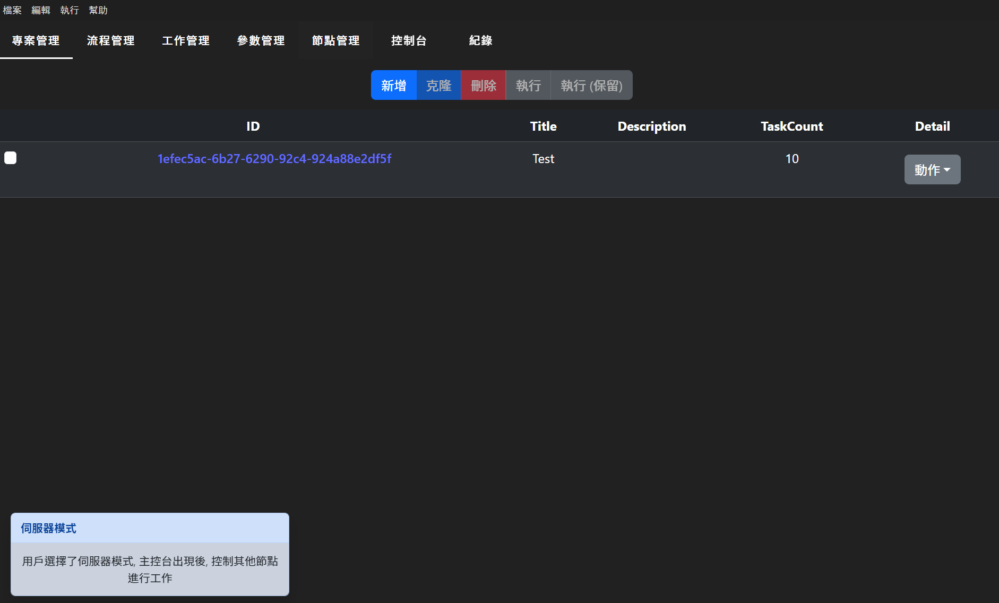
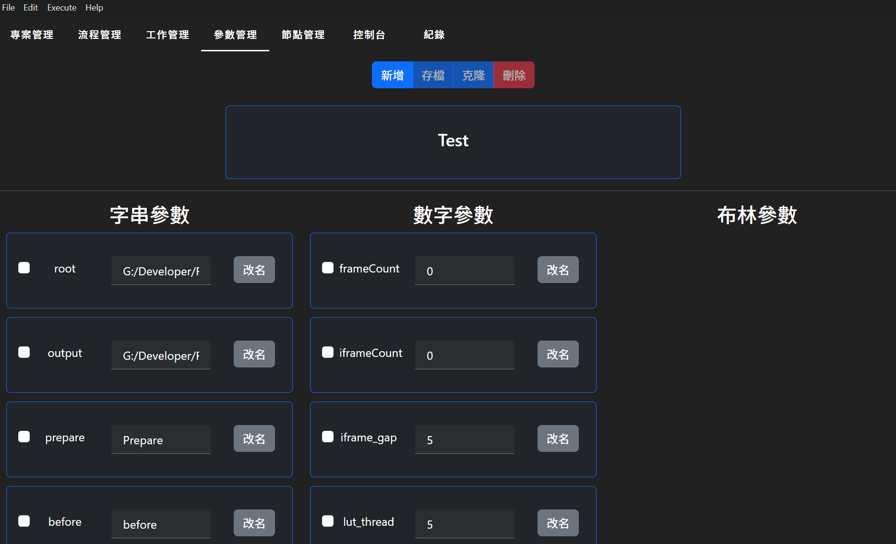
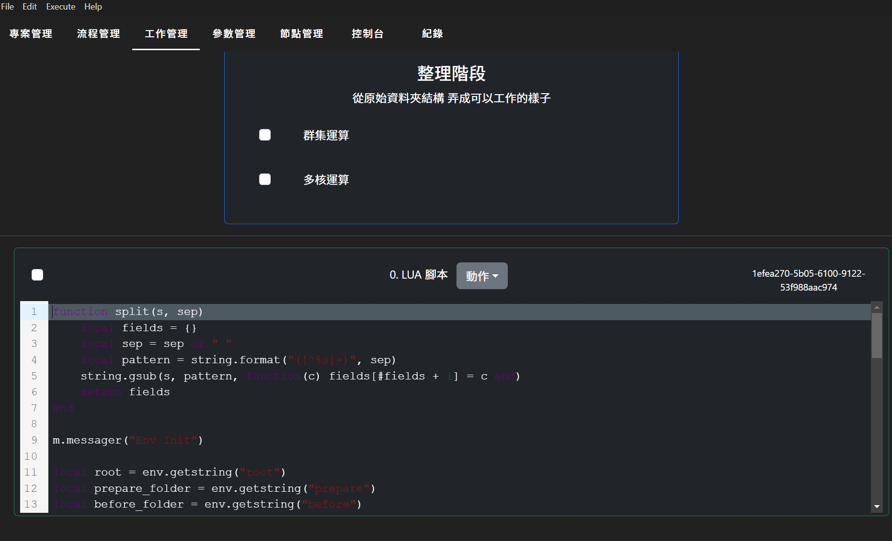
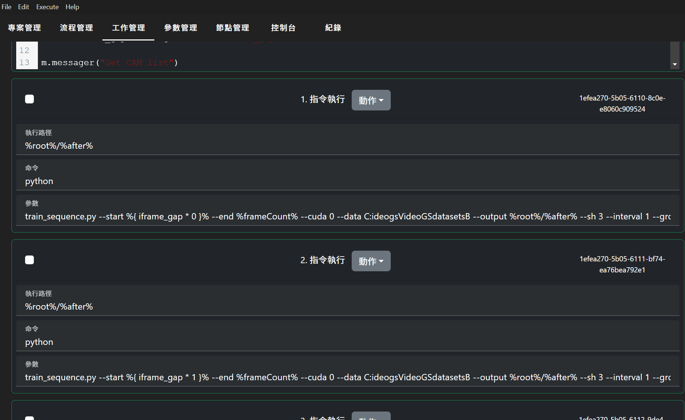
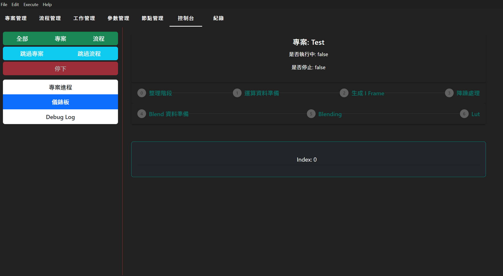

# 流程工具

這是一套分散式運算的執行框架
目的是為了讓多台電腦執行複雜之任務分配

[ply 工具](./ply_tool/README.md)

[Demo](https://elly2018.github.io/Compute-Tool/)

## 安裝流程

> 桌上型應用安裝

在 Release 的頁面, 每一次的 Beta 版本釋出將會提供一項連結\
下載後面雲端空間的 .rar 檔案\
解除壓縮檔案後找到 compute_tool.exe 打開即可

> Docker 節點\
> 需要 Docker 安裝

專案根根目錄運行 docker_node.sh

> Docker 網站\
> 需要 Docker 安裝

專案根目錄運行 docker_server.sh

## 功能簡介

### 工作排序方案

分為專案, 流程, 工作

你還可以定義專案的參數值讓各個工作可以存取

#### 專案

頂分類, 作為任務系統中的最上層容器存在

#### 流程

程序容器, 會根據 UI 的排序一一執行

- Cron: 多台電腦執行流程
- Multi: 單一電腦可以多核心處裡工作

如果 Cron 跟 Multi 都是關閉的情況下, 代表伺服器會選擇一台電腦執行一遍就結束 (單一)\
如果 Cron 有勾選, 伺服器會根據選擇的 Cron 參數執行多次 (群集)

> 在群集運算的模式中, 要存取到目前執行的 ID 用 'ck' 來抓取數字參數\
> ck 從 1 開始

#### 工作

節點要執行的一連串動作

#### 參數

專案的參數值, 支援布林, 字串, 跟數字三種資料型態

### Lua 功能

你可以在工作中定義 Lua 腳本運行\
針對 Lua 可以使用的函式, 可以參考[這裡](./docs/Lua.md)

### 變數表達式

使用了 [expressionparser](https://www.npmjs.com/package/expressionparser) 當作為表達式使用, 這樣可以克服 eval 的不支援問題

### 監控系統

你可以即時看到目前正在運行的工作, 在控制台進行管理跟監控

## 功能一覽

- [x] 任務排序資料結構
- [x] 樣板支援
- [x] 即時監控 UI 管理頁面
- [x] 分散式運算支援
- [x] 腳本支援
- [x] 專案變數表達式支援
- [x] Docker 支援
- [x] 純粹節點 node 支援
- [ ] 單一電腦多核心支援
- [ ] 記錄所有資訊, 並且可以恢復任務
